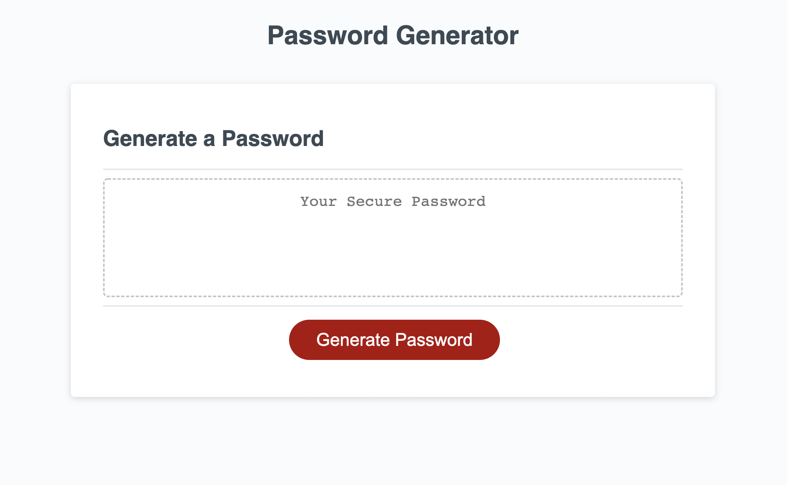

# 03 JavaScript: Password Generator

## Description

In order to enable the employees to generate random passwords based on the criteria that they are selecting, I altered the starter code and created an application to make it possible for them. Since the app is linked to HTML and CSS, by changing the criteria in java script, the employees are able to see the changes when they select their criteria dynamically in the browser.


## Acceptance Criteria

```
Using querySelector () to return the first element that matches the specified CSS selector

Setting the Global variables for Uppercase letter, lowerecase letters, numbers and/or special charecters

Determine the Function

Using the prompts to ask question form the employee for the prefered length of the password from 8 to 128

Using if with series of confirms to receive a True or False reply from the employee to create a random password based on their chosen criteria
to generate their random password

Using the for Loop to creat a random password (based on the employees' selected criteria)


## Screenshot

You can observe the web application's appearance and functionality by looking at the following image:



## Lisence

MIT lisence 2022 version

# 03 JavaScript: Password Generator

## Your Task

In order to enable the employees to generate random passwords based on the criteria that they are selecting, I altered the starter code and created an application to make it possible for them. Since the app is linked to HTML and CSS, by changing the criteria in java script, the employees are able to see the changes when they select their criteria dynamically in the browser.


## Acceptance Criteria

```
Using querySelector () to return the first element that matches the specified CSS selector

Setting the Global variables for Uppercase letter, lowerecase letters, numbers and/or special charecters

Determine the Function

Using the prompts to ask question form the employee for the prefered length of the password from 8 to 128

Using if with series of confirms to receive a True or False reply from the employee to create a random password based on their chosen criteria
to generate their random password

Using the for Loop to creat a random password (based on the employees' selected criteria)


## Screenshot

You can observe the web application's appearance and functionality by looking at the following image:


## Lisence

<<<<<<< HEAD
- - -
© 2022 Trilogy Education Services, LLC, a 2U, Inc. brand. Confidential and Proprietary. All Rights Reserved.

=======
MIT lisence 2022 version
>>>>>>> bcf40cb6f202ac08c35c9d1af1b5b9b47a97e1ac
